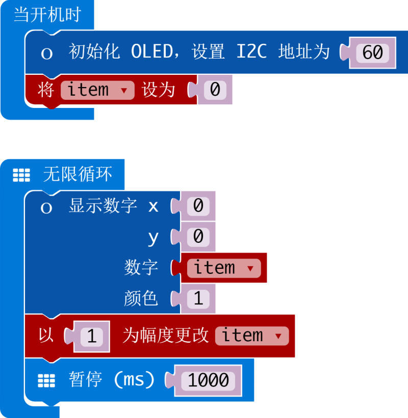

# I2C 接口 OLED 128x64 模块

makecode 的 microbit 版 I2C 接口 OLED 128x64 显示模块扩展。  

部分驱动代码来自 fizban99 的 microbit OLED 驱动:  
https://github.com/fizban99/microbit_ssd1306

作者: shaoziyang  
时间: 2018年5月  

  
  

## 添加扩展

打开 makecode 编辑器，在项目中选择扩展，然后在地址栏输入下面网址  

https://github.com/makecode-packages/OLED12864_I2C_cn  

搜索后就可以添加并使用扩展了。


## 基本用法

```
let item = 0
OLED12864_I2C.init(60)
OLED12864_I2C.rect(0, 0, 60, 30, 1)
OLED12864_I2C.showString(0, 0, "Hello!", 1)
OLED12864_I2C.showString(0, 1, "1234567890", 0)
item = 0
basic.forever(() => {
    OLED12864_I2C.showNumber(0, 3, item, 1)
    item += 1
    basic.pause(1000)
}) 
```


## API

- **init(addr: number)**  
初始化 OLED 模块.
addr: OLED 模块的 I2C 地址，默认是 60，可以通过内部电阻设置为 61。

- **zoom(d: boolean = true)**  
设置为放大模式，在放大模式下，所以内容会以两倍大小显示。  
d: 模式
  - true, 放大模式。
  - false, 正常模式。

- **on()**  
打开屏幕显示。

- **off()**  
关闭屏幕显示。

- **clear()**  
清除屏幕显示内容。

- **draw()**  
刷新屏幕的显示内容。  

- **invert(d: boolean = true)**  
反显模式。

- **pixel(x: number, y: number, color: number = 1)**  
在屏幕上绘制一个像素
  - x, X 坐标，放大模式下范围是 0 - 63，正常模式下范围是 0 - 127。  
  - y, Y 坐标，放大模式下范围是 0 - 31，正常模式下范围是 0 - 63。 
  - color, 像素颜色，可以是 1 或 0。

- **showString(x: number, y: number, s: string, color: number = 1)**  
显示一个字符串.
  - x, X 坐标, 放大模式下范围是 0 - 11，正常模式下范围是 0 - 23。  
  - y, Y 资本，放大模式下范围是 0 - 3，正常模式下范围是 0 - 7。 
  - s, the text will be show
  - color, 显示颜色，可以是 1 或 0。

- **showNumber(x: number, y: number, num: number, color: number = 1)**  
显示一个整数。
  - x, X 坐标, 放大模式下范围是 0 - 11，正常模式下范围是 0 - 23。  
  - y, Y 资本，放大模式下范围是 0 - 3，正常模式下范围是 0 - 7。 
  - s, the text will be show
  - color, 显示颜色，可以是 1 或 0。

- **hline(x: number, y: number, len: number, color: number = 1)**  
绘制水平线段  
  - (x, y), 起始点坐标
  - len, 线段长度
  - color, 显示颜色，可以是 1 或 0。

- **vline(x: number, y: number, len: number, color: number = 1)**  
绘制垂直线段  
  - (x, y), 起始点坐标
  - len, 线段长度
  - color, 显示颜色，可以是 1 或 0。

- **rect(x1: number, y1: number, x2: number, y2: number, color: number = 1)**  
绘制矩形
  - (x1, y1), 开始点坐标
  - (x2, y2), 结束点坐标
  - len, 线段长度
  - color, 显示颜色，可以是 1 或 0。

## 演示

  


## 授权方式

MIT

microbit/micropython 中文社区版权所有 (c) 2018  

## 支持硬件

* for PXT/microbit


[来自 microbit/micropython 中文社区](http://www.micropython.org.cn)  
